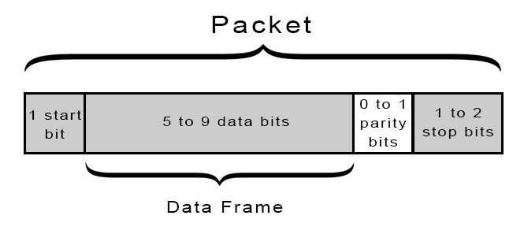
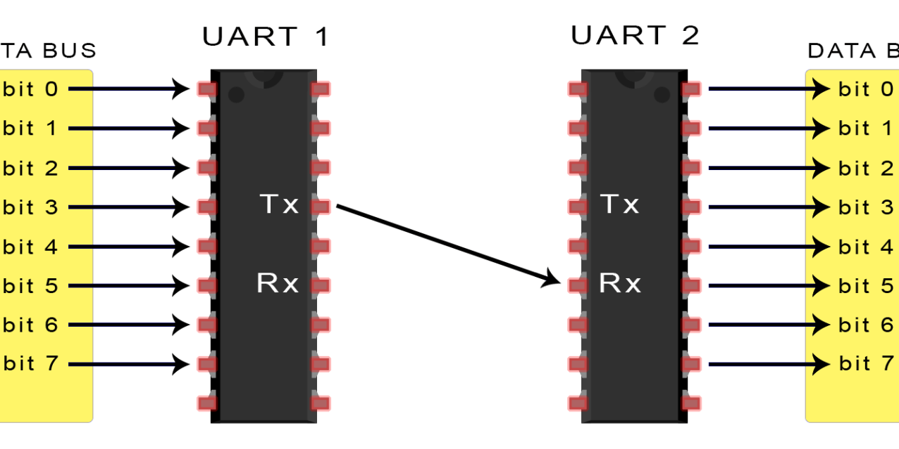

###UART Protocole
	**U**niversal **A**synchronous **R**eceiver/**T**ransmitter

A l'origine, les uarts ressemblaient a ceci:

			  __
		1	-|  |-  1 -----<---------------1
		2	-|  |-	2 ------<--------------0
		3	-|  |-	3 -------<-------------1
		4	-|  |-	4 --------<------------1
		5	-|  |-	5 ---------<-----------1
		6	-|  |-	6 ----------<----------0
		7	-|  |-	7 -----------<---------1
		8	-|  |-	8 ------------<--------0
			  --

Les bits etaient envoyes en parallele, une pattes par bits.

Maintenant, L'UART est plus souvent un circuit physique dans le microcontroleur,

>C'est a dire qu'il est inclut dans le PIC32 !

 Il sert a transmettre et a recevoir des datas en serie.
	Les datas sont organisees en "packets"

  il utilise deux fils.
  Un bits de starts est set pour savoir quand lire les bits.
  La vitesse de transmission est calcule avec des multiple et des sous multiples de baud

>Les deux uart qui communiquent ensemble doivent avoir les memes baud rates (bps).

soit un packet :

TX -> Transmitter
RX -> Receiver

[Basic Uart](http://www.circuitbasics.com/basics-uart-communication/)
